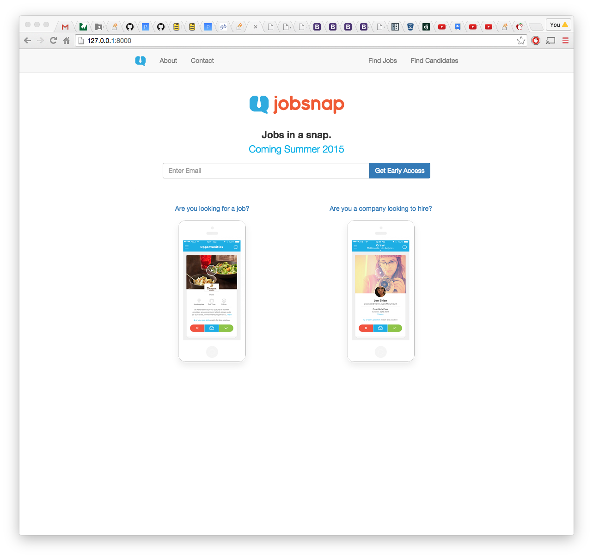
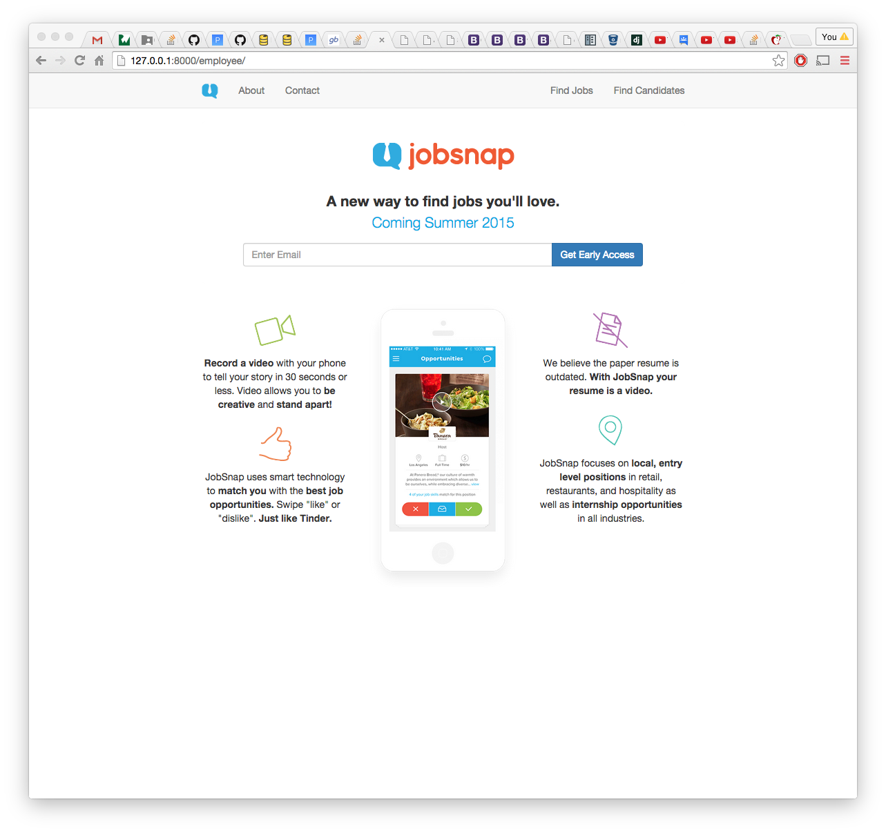
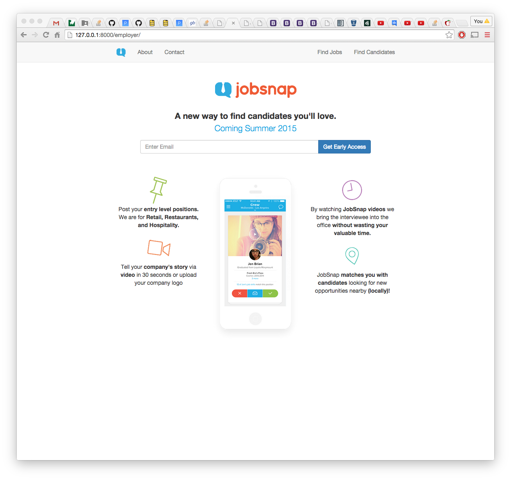
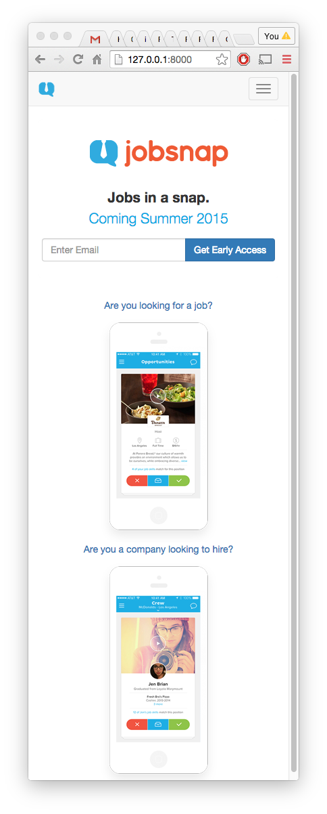
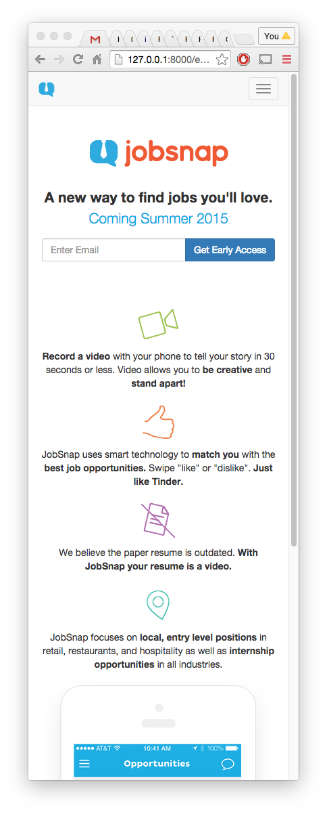

# JobSnap
The following instruction manual is mostly copied from 
https://github.com/kirpit/django-sample-app

The sample application comes with:
* [Twitter Bootstrap](http://getbootstrap.com/) v3.3.5

And its current `requirements.txt` file is:

```
Django==1.8.2
django-crispy-forms==1.4.0
wsgiref==0.1.2
```

## Installation

### 1. Download
Now, you need the *JobSnap* project files in your workspace:

    $ cd /path/to/your/workspace
    $ git clone https://github.com/neysay/JobSnap.git jobsnapCo
    $ cd jobsnapCo
    $ virtualenv env
    $ source env/bin/activate

### 2. Requirements
Right there, you will find the *requirements.txt* file that has all the great debugging tools, django helpers and some other cool stuff. To install them, simply type:

`$ pip install -r requirements.txt`

### 3. Tweaks

#### SECRET_KEY
Go to <http://www.miniwebtool.com/django-secret-key-generator/>, create your secret key, copy it. Open your `src/jobsnapCo/settings.py`, find `SECRET_KEY` line, paste your secret key.


#### Initialize the database
First set the database engine (PostgreSQL, MySQL, etc..) in your settings files; `src/jobsnapCo/settings.py`. Of course, remember to install necessary database driver for your engine. Then define your credentials as well. Time to finish it up:

`python ./src/manage.py migrate`

### Ready? Go!
```
$ cd src
$ python manage.py runserver
```

## Sample Images








